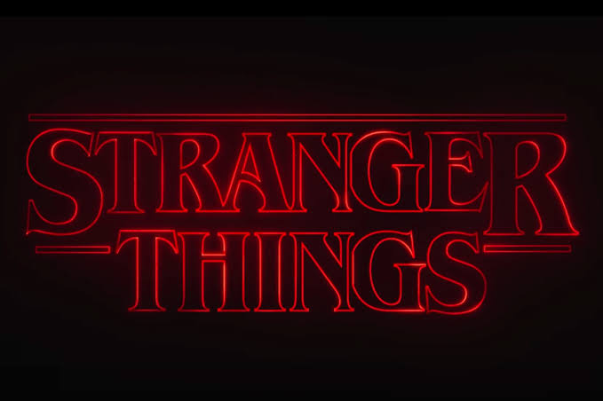

# _**Stranger Things Intro**_



Este projeto é uma recriação da icônica sequência de título de "Stranger Things" usando JavaScript, HTML e CSS.

## 📺 Introdução

A introdução inclui animações e transições de texto dinâmicas, sincronizadas com uma faixa de áudio. O projeto utiliza verificações do Modernizr para garantir a compatibilidade com recursos essenciais e fornece alternativas para navegadores não suportados.

---

## 🎛️ Recursos

- **Texto Dinâmico**: Os elementos de texto são animados dinamicamente, criando o efeito característico do título de "Stranger Things".
  
- **Integração de Áudio**: A introdução reproduz uma faixa de áudio ("StrangerThings.mp3") sincronizada com a animação para uma experiência imersiva.
  
- **Verificações de Compatibilidade**: As verificações do Modernizr garantem a compatibilidade com recursos essenciais, como áudio, animações CSS e sombra de texto, fornecendo alternativas para navegadores não suportados.

---

## 📋 Uso

1. Clone o repositório.
    ```sh
    git clone https://github.com/seu-usuario/stranger-things-intro.git
    ```
2. Abra `index.html` em um navegador moderno, de preferência Google Chrome, para a melhor experiência.
3. Certifique-se de que seu navegador suporta áudio, animações CSS e sombra de texto para o efeito completo.

---

## 🎨 Personalização

Sinta-se à vontade para personalizar o texto, as cores e outros elementos visuais modificando os arquivos HTML e CSS. Adicione sua própria faixa de áudio para personalizar a experiência.

---

## 💡 Agradecimentos

- O projeto é inspirado na sequência de título de "Stranger Things".
- Faixa de áudio: "StrangerThings.mp3".


---

## 🌟 Pré-visualização


---

## 🛠️ Ferramentas Utilizadas

- **HTML**: Estrutura da página.
- **CSS**: Estilização e animações.
- **JavaScript**: Controle das animações e sincronização de áudio.
- **Modernizr**: Verificações de compatibilidade.

---

## 🧇 Contribuições

Contribuições são bem-vindas! Siga os passos abaixo para contribuir:

1. Fork o projeto.
2. Crie uma branch com a sua feature (`git checkout -b feature/AmazingFeature`).
3. Faça commit das suas alterações (`git commit -m 'Add some AmazingFeature'`).
4. Faça push para a branch (`git push origin feature/AmazingFeature`).
5. Abra um Pull Request.

---

## 📞 Contato

- **E-mail**: seu-email@example.com
- **LinkedIn**: [Seu Nome](https://www.linkedin.com/in/seu-usuario/)

---


---

**Divirta-se recriando a magia de Stranger Things!**

